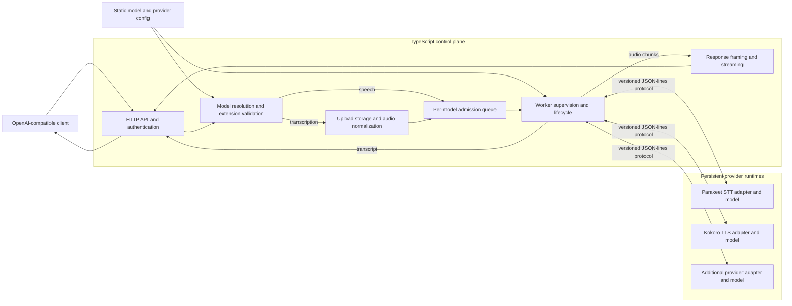

# OpenAI-Compatible Speech Server

OpenAI-Compatible Speech Server is a standalone, provider-neutral HTTP service for persistent local speech-to-text and text-to-speech models. A TypeScript/Node control plane supervises versioned external worker processes; clients never receive provider paths, commands, or credentials. Parakeet STT and Kokoro TTS workers are bundled as the initial providers.

This independent project implements a compatible subset of OpenAI's Audio API. It is not affiliated with or endorsed by OpenAI.

## Architecture



The control plane owns the public contract, security, validation, input normalization, scheduling, response streaming, and process recovery. Provider workers own model initialization, inference, and provider-specific output normalization, so adding a runtime does not add routes or expose provider configuration to clients.

## Requirements

- Node.js 22 or newer and npm
- ffmpeg at the configured absolute path
- A Parakeet Python environment containing PyTorch and NVIDIA NeMo ASR
- A Kokoro Python environment containing `kokoro`, NumPy, and its model assets
- Private LAN, authenticated overlay, or TLS termination; the service is not intended for the public Internet

Model/checkpoint and voice licensing must be reviewed for the intended deployment. The service does not redistribute model artifacts.

## Setup

```bash
npm ci
npm run check
npm run build
mkdir -p ~/.config/openai-speech-server ~/.local/state/openai-speech-server/tmp
cp config/openai-speech-server.example.yaml ~/.config/openai-speech-server/config.yaml
npx tsx scripts/create-token.ts t3-dev
```

The token command prints the only plaintext copy and stores its SHA-256 hash in `tokens.json`. Update the host-local config for installed environments and voices. Run directly with:

```bash
OPENAI_SPEECH_SERVER_CONFIG=$HOME/.config/openai-speech-server/config.yaml npm start
```

Install and start the user service with `scripts/install-systemd.sh`. The installer renders the unit with the current repository, Node, XDG config, and XDG state paths. Inspect it with `journalctl --user -u openai-speech-server -f`. User lingering (`loginctl enable-linger "$USER"`) is required if it must start before interactive login.

## API

Except for `/health/live` and `/health/ready`, requests require `Authorization: Bearer <token>`. Every response includes `X-Request-Id`.

- `GET /v1/models`: permitted OpenAI-shaped model list
- `GET /v1/audio/capabilities`: authoritative permitted models, voices, formats, controls, and readiness
- `POST /v1/audio/transcriptions`: OpenAI-compatible multipart input with final JSON/text or final-only SSE when `stream=true`
- `POST /v1/audio/speech`: OpenAI-compatible JSON input; streams PCM or WAV bytes as they are produced
- `GET /metrics`: authenticated Prometheus metrics when enabled

```bash
curl -H "Authorization: Bearer $OPENAI_SPEECH_SERVER_TOKEN" http://192.168.50.72:6624/v1/audio/capabilities
curl -H "Authorization: Bearer $OPENAI_SPEECH_SERVER_TOKEN" -F model=default -F file=@sample.webm http://192.168.50.72:6624/v1/audio/transcriptions
curl -H "Authorization: Bearer $OPENAI_SPEECH_SERVER_TOKEN" -H 'Content-Type: application/json' -d '{"model":"default","voice":"default","input":"Hello","response_format":"pcm","speed":1}' http://192.168.50.72:6624/v1/audio/speech -o speech.pcm
```

The OpenAI audio shape is the primary interface, but this service does not claim every OpenAI model, format, or Realtime API. `model=default` resolves the configured default model for that task, and `voice=default` resolves the speech model's default voice. Supported controls such as `speed`, `language`, formats, and streaming are mapped to provider requests. Recognized but inapplicable hints such as a prompt for a model without prompt support, plus unknown top-level OpenAI fields, are ignored with field-name-only warnings. Representation-changing values such as unsupported response or stream formats remain errors.

Provider-specific controls belong in namespaced entries under `extensions` rather than new top-level fields. Each model config supplies a JSON Schema for every namespace. The server validates values, applies schema defaults after a namespace is requested, rejects unknown namespaces, and advertises the schemas through capabilities. Transcription sends `extensions` as a JSON object form field. Speech sends it as a JSON object property.

Raw PCM is signed 16-bit little-endian mono, served as `audio/pcm` with explicit `format=s16le`, rate, and channel parameters. Provider adapters must normalize their native output to this contract before yielding bytes. Streaming WAV uses the same little-endian samples with unknown-length RIFF sizes. A transport error during synthesis means the entire result failed.

## Operations

Readiness stays false until every required provider replica has warmed. Each replica handles one inference at a time; excess work enters a bounded per-model queue. Worker exits and malformed protocol output fail active requests and trigger bounded exponential restart. Configure `warmup_timeout_seconds` per provider to cover model download, load, and device initialization on the target host. Client disconnects request cooperative cancellation. Configure `cancel_grace_seconds` per provider: chunked engines can use a short deadline, while blocking engines should use a deadline longer than their worst expected inference so normal aborts finish without evicting the warm model but genuine hangs still recover.

The service drains HTTP traffic on `SIGTERM`, stops the worker process group, and is forcibly terminated after the configured shutdown deadline. Run a remote deployment check from `srv` with:

```bash
OPENAI_SPEECH_SERVER_URL=http://192.168.50.72:6624 OPENAI_SPEECH_SERVER_TOKEN=... npm run smoke
```

On this WSL host the service binds only `172.19.116.45:6624`. Windows forwards the private-LAN endpoint `192.168.50.72:6624` to that socket, so it does not listen on the Tailscale interface.

GPU/model tests require the real configured environments and are intentionally separate from the deterministic fake-worker test suite run by `npm test`.

## Adding Providers

The API, registry, authorization, queues, and lifecycle logic operate on `transcription` and `speech` capabilities rather than engine names. A new provider is a persistent Python worker that implements the newline-delimited protocol in `workers/common.py`: accept protocol version 1 `init`, `request`, `cancel`, and `shutdown` messages and emit `ready`, `result` or base64 `chunk`, `done`, `cancelled`, and `error` messages with matching request IDs.

Set any stable `provider` name and an explicit Python script in `provider_config.command`. The `init` message contains `model_id`, `task`, `provider`, `device`, optional `checkpoint`, and the host-controlled `provider_config.options` object. Transcription requests contain a normalized WAV path plus optional language, prompt, and validated extensions. Speech requests contain input, voice, speed, format, and validated extensions and stream audio chunks. New engines therefore require a worker adapter and configuration, but no new HTTP route, auth rule, scheduler, or client contract.

For example, a provider with extra synthesis controls can declare a namespace and initialization options:

```yaml
- id: xtts-v2
  task: speech
  provider: xtts
  default_voice: alice
  voices: [alice, bob]
  output_formats: [pcm, wav]
  extensions:
    xtts:
      schema:
        type: object
        additionalProperties: false
        properties:
          language: { type: string, enum: [en, es, fr], default: en }
          temperature: { type: number, minimum: 0, maximum: 2, default: 0.7 }
  provider_config:
    python: /opt/xtts/bin/python
    command: /opt/openai-speech-server/workers/xtts/worker.py
    checkpoint: coqui/XTTS-v2
    device: auto
    workers: 1
    warmup_timeout_seconds: 900
    cancel_grace_seconds: 30
    options:
      precision: fp16
      speaker_directory: /opt/xtts/speakers
```

The client opts into those controls with `"extensions":{"xtts":{"temperature":0.9}}`. Initialization options never come from requests. Provider workers must still normalize speech output to the documented 24 kHz mono s16le contract.
