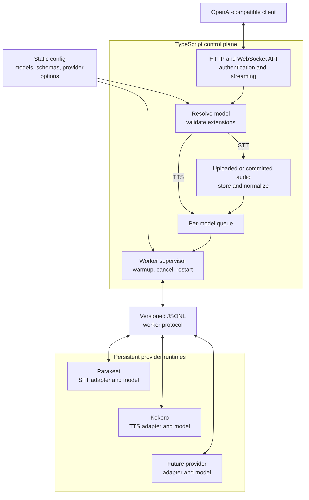

# OpenAI-Compatible Speech Server

OpenAI-Compatible Speech Server is a standalone, provider-neutral HTTP and WebSocket service for persistent local speech-to-text and text-to-speech models. A TypeScript/Node control plane supervises versioned external worker processes; clients never receive provider paths, commands, or credentials. Parakeet STT and Kokoro TTS workers are bundled as the initial providers.

This independent project implements a compatible subset of OpenAI's Audio API. It is not affiliated with or endorsed by OpenAI.

## Architecture


```mermaid
flowchart TB
    Client[OpenAI-compatible client]
    Config[Static config<br/>models, schemas, provider options]

    subgraph Node[TypeScript control plane]
        direction TB
        API[HTTP and WebSocket API<br/>authentication and streaming]
        Validate[Resolve model<br/>validate extensions]
        Input[Uploaded or committed audio<br/>store and normalize]
        Queue[Per-model queue]
        Supervisor[Worker supervisor<br/>warmup, cancel, restart]
    end

    Protocol[Versioned JSONL<br/>worker protocol]

    subgraph Runtimes[Persistent provider runtimes]
        direction LR
        Parakeet[Parakeet<br/>STT adapter and model]
        Kokoro[Kokoro<br/>TTS adapter and model]
        Additional[Future provider<br/>adapter and model]
        Parakeet ~~~ Kokoro ~~~ Additional
    end

    Client <--> API
    Config --> Validate
    Config --> Supervisor
    API --> Validate
    Validate -- STT --> Input
    Validate -- TTS --> Queue
    Input --> Queue
    Queue --> Supervisor
    Supervisor <--> Protocol
    Protocol <--> Parakeet
    Protocol <--> Kokoro
    Protocol <--> Additional
```

The control plane owns the public contract, security, validation, input normalization, scheduling, response streaming, and process recovery. Provider workers own model initialization, inference, and provider-specific output normalization, so adding a runtime does not add routes or expose provider configuration to clients.

## Requirements

- Node.js 22 or newer and npm
- ffmpeg at the configured absolute path
- A Parakeet Python environment containing PyTorch and NVIDIA NeMo ASR
- A Kokoro Python environment containing `kokoro`, NumPy, and its model assets
- Private LAN, authenticated overlay, or TLS termination; the service is not intended for the public Internet

Model/checkpoint and voice licensing must be reviewed for the intended deployment. The service does not redistribute model artifacts.

## Setup

```bash
npm ci
npm run check
npm run build
mkdir -p ~/.config/openai-speech-server ~/.local/state/openai-speech-server/tmp
cp config/openai-speech-server.example.yaml ~/.config/openai-speech-server/config.yaml
npx tsx scripts/create-token.ts t3-dev
```

The token command prints the only plaintext copy and stores its SHA-256 hash in `tokens.json`. Update the host-local config for installed environments and voices. Run directly with:

```bash
OPENAI_SPEECH_SERVER_CONFIG=$HOME/.config/openai-speech-server/config.yaml npm start
```

Install and start the user service with `scripts/install-systemd.sh`. The installer renders the unit with the current repository, Node, XDG config, and XDG state paths. Inspect it with `journalctl --user -u openai-speech-server -f`. User lingering (`loginctl enable-linger "$USER"`) is required if it must start before interactive login.

## API

Except for `/health/live` and `/health/ready`, requests require `Authorization: Bearer <token>`. Every response includes `X-Request-Id`.

- `GET /v1/models`: permitted OpenAI-shaped model list
- `GET /v1/audio/capabilities`: authoritative permitted models, voices, formats, controls, and readiness
- `POST /v1/audio/transcriptions`: OpenAI-compatible multipart input with final JSON/text or final-only SSE when `stream=true`
- `POST /v1/audio/speech`: OpenAI-compatible JSON input; streams PCM or WAV bytes as they are produced
- `GET /v1/realtime?intent=transcription`: authenticated WebSocket for GA Realtime transcription with client-controlled commits
- `GET /metrics`: authenticated Prometheus metrics when enabled

```bash
curl -H "Authorization: Bearer $OPENAI_SPEECH_SERVER_TOKEN" http://192.168.50.72:6624/v1/audio/capabilities
curl -H "Authorization: Bearer $OPENAI_SPEECH_SERVER_TOKEN" -F model=default -F file=@sample.webm http://192.168.50.72:6624/v1/audio/transcriptions
curl -H "Authorization: Bearer $OPENAI_SPEECH_SERVER_TOKEN" -H 'Content-Type: application/json' -d '{"model":"default","voice":"default","input":"Hello","response_format":"pcm","speed":1}' http://192.168.50.72:6624/v1/audio/speech -o speech.pcm
```

The OpenAI audio shape is the primary interface, but this service does not claim every OpenAI model, format, or Realtime feature. For HTTP requests, `model=default` resolves the configured default model for that task, and `voice=default` resolves the speech model's default voice. Supported controls such as `speed`, `language`, formats, and streaming are mapped to provider requests. Recognized but inapplicable HTTP hints such as a prompt for a model without prompt support, plus unknown top-level OpenAI HTTP fields, are ignored with field-name-only warnings. Representation-changing values such as unsupported response or stream formats remain errors. Realtime events instead reject unsupported fields explicitly.

Provider-specific controls belong in namespaced entries under `extensions` rather than new top-level fields. Each model config supplies a JSON Schema for every namespace. The server validates values, applies schema defaults after a namespace is requested, rejects unknown namespaces, and advertises the schemas through capabilities. Transcription sends `extensions` as a JSON object form field. Speech sends it as a JSON object property.

Raw PCM is signed 16-bit little-endian mono, served as `audio/pcm` with explicit `format=s16le`, rate, and channel parameters. Provider adapters must normalize their native output to this contract before yielding bytes. Streaming WAV uses the same little-endian samples with unknown-length RIFF sizes. A transport error during synthesis means the entire result failed.

## Realtime transcription

The [protocol reference](docs/realtime.md) documents the supported events, error shapes, and lifecycle.

[Sedes Android](https://github.com/kcosr/sedes/blob/main/docs/operator/clients/voice.md) uses this endpoint for local transcription and `/v1/audio/speech` for playback. In its Voice settings, choose **Own speech server**, enter this server's API base including `/v1`, and save a server token. Select the permitted local models and voice from the discovered catalog; the example configuration names them `parakeet-local` and `kokoro-local`. Hosted OpenAI access is configured directly in Sedes and does not pass through this server.

Connect to `/v1/realtime?intent=transcription` with `Authorization: Bearer <token>`. This implements the current GA transcription event shape without a beta header or beta event aliases. The server sends `session.created` with `audio.input.transcription: null`; select an authorized local model and wait for `session.updated` before recording:

```json
{"type":"session.update","session":{"type":"transcription","audio":{"input":{"format":{"type":"audio/pcm","rate":24000},"transcription":{"model":"parakeet-local"},"turn_detection":null,"noise_reduction":null}}}}
```

Send signed 16-bit little-endian mono PCM at 24 kHz as canonical Base64 in `input_audio_buffer.append` events. Append has no acknowledgment. After at least 100 ms of audio, send `input_audio_buffer.commit`. The server responds with `input_audio_buffer.committed`, including `item_id` and `previous_item_id`, then emits one `conversation.item.input_audio_transcription.completed` containing that `item_id`, `content_index: 0`, `transcript`, and duration-based `usage`. Local Parakeet performs batch inference on the committed audio and emits no transcript deltas. Audio is normalized through the configured ffmpeg to the existing worker's 16 kHz WAV input.

Clients own speech detection, trailing silence, no-speech deadlines, and maximum capture time. The server supports only `audio/pcm` at 24 kHz with null turn detection and noise reduction. It rejects conversational Realtime, `response.*`, logprobs, provider extensions, and unsupported settings. Optional transcription `language` and model-supported `prompt` are accepted. Partial session updates change supplied settings atomically and are allowed only between utterances. Set `prompt: ""` to remove a prompt, or `audio.input.transcription: null` to disable transcription and clear all its settings before selecting a model again. `model: "default"` uses the existing authorized default-model resolution.

`input_audio_buffer.clear` clears uncommitted audio and produces `input_audio_buffer.cleared`; it does not cancel a committed job. Closing the connection cancels queued or running work and suppresses late results. Every session consumes one shared client concurrency slot until the connection is closed and its worker/file cleanup finishes. HTTP and Realtime transcription use the same bounded model queues and persistent worker pool. A session permits one committed job at a time and can buffer its next utterance while that job runs. A final success or failure event means the previous job has finished cleanup and a new commit can begin.

Request errors use the standard `error` event, with the causing client `event_id` under `error.event_id` when provided. Committed failures use `conversation.item.input_audio_transcription.failed` with the committed `item_id`. Server-generated event IDs are independent of client event IDs. Clients should fail the attempt on a transport error; recordings are never replayed automatically.

The `server.realtime` defaults bound a buffer to 5,760,000 decoded bytes (120 seconds), each JSON message to 1 MiB, pending output to 1 MiB, idle connections to 60 seconds, and session lifetime to one hour. A lower configured model duration also limits each buffer. Realtime normalization derives its output bound from the committed audio duration and WAV overhead, independently of the HTTP upload limit. Buffer overflow fails explicitly and closes the socket; audio is not truncated. Idle timing pauses during inference, which instead uses the existing request deadline and provider cancellation grace. Session expiration and service shutdown cancel owned work. See the [Realtime transcription reference](https://developers.openai.com/api/docs/guides/realtime-transcription) for the standard protocol.

## Operations

For a reverse proxy, preserve bearer authentication and allow the HTTP/1.1 WebSocket upgrade for `/v1/realtime`. Disable response buffering for streamed speech. If the public API uses a path prefix, strip it before forwarding to this server's `/v1` routes and include it in the client's API base.

Readiness stays false until every required provider replica has warmed. Each replica handles one inference at a time; excess work enters a bounded per-model queue. Worker exits and malformed protocol output fail active requests and trigger bounded exponential restart. Configure `warmup_timeout_seconds` per provider to cover model download, load, and device initialization on the target host. Client disconnects request cooperative cancellation. Configure `cancel_grace_seconds` per provider: chunked engines can use a short deadline, while blocking engines should use a deadline longer than their worst expected inference so normal aborts finish without evicting the warm model but genuine hangs still recover.

The service drains HTTP traffic on `SIGTERM`, stops the worker process group, and is forcibly terminated after the configured shutdown deadline. Run a deployment smoke check against a reachable server endpoint with:

```bash
OPENAI_SPEECH_SERVER_URL=http://192.168.50.72:6624 OPENAI_SPEECH_SERVER_TOKEN=... npm run smoke
```

GPU/model tests require the real configured environments and are intentionally separate from the deterministic fake-worker test suite run by `npm test`.

Host tests still require audio-capable ffmpeg. Set `OPENAI_SPEECH_FFMPEG=/absolute/path/to/ffmpeg` to override `/usr/bin/ffmpeg` for tests without changing production configuration. The loopback-only `scripts/test-fixture.ts` starts the real HTTP/WebSocket API with deterministic CPU workers for native-client conformance testing; it prints its temporary URL, generated test token, and separate authenticated fixture-control URL as a JSON ready event. Run it from this repository using `node --import tsx scripts/test-fixture.ts`. It shuts down on stdin EOF or `{"type":"shutdown"}` and removes its temporary state. It is a test fixture, not a deployment entry point.

## Adding Providers

The API, registry, authorization, queues, and lifecycle logic operate on `transcription` and `speech` capabilities rather than engine names. A new provider is a persistent Python worker that implements the newline-delimited protocol in `workers/common.py`: accept protocol version 1 `init`, `request`, `cancel`, and `shutdown` messages and emit `ready`, `result` or base64 `chunk`, `done`, `cancelled`, and `error` messages with matching request IDs.

Set any stable `provider` name and an explicit Python script in `provider_config.command`. The `init` message contains `model_id`, `task`, `provider`, `device`, optional `checkpoint`, and the host-controlled `provider_config.options` object. Transcription requests contain a normalized WAV path plus optional language, prompt, and validated extensions. Speech requests contain input, voice, speed, format, and validated extensions and stream audio chunks. New engines therefore require a worker adapter and configuration, but no new HTTP route, auth rule, scheduler, or client contract.

For example, a provider with extra synthesis controls can declare a namespace and initialization options:

```yaml
- id: xtts-v2
  task: speech
  provider: xtts
  default_voice: alice
  voices: [alice, bob]
  output_formats: [pcm, wav]
  extensions:
    xtts:
      schema:
        type: object
        additionalProperties: false
        properties:
          language: { type: string, enum: [en, es, fr], default: en }
          temperature: { type: number, minimum: 0, maximum: 2, default: 0.7 }
  provider_config:
    python: /opt/xtts/bin/python
    command: /opt/openai-speech-server/workers/xtts/worker.py
    checkpoint: coqui/XTTS-v2
    device: auto
    workers: 1
    warmup_timeout_seconds: 900
    cancel_grace_seconds: 30
    options:
      precision: fp16
      speaker_directory: /opt/xtts/speakers
```

The client opts into those controls with `"extensions":{"xtts":{"temperature":0.9}}`. Initialization options never come from requests. Provider workers must still normalize speech output to the documented 24 kHz mono s16le contract.
